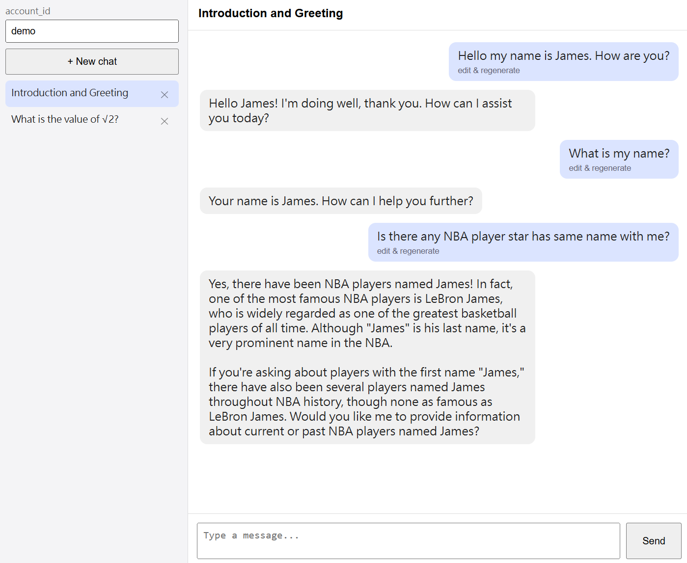

# Introduction

This repo contains several common components for LLM products,

each is in either SDK or API form which can be easily applied to any projects 

# llm_server (API)

support services

+ Ollama
+ VLLM

# llm_client (Python SDK)

Several common functions for calling llm.

1. **uniform request interface**: `llm_client/llm_client/llm_calls/`
    + client includes
        + azure openai
        + google
        + ollama
        + openai
        + vllm
    + include both
        + chat models
        + embedding models
    + support
        + pydantic response
        + async request (azure openai only)

2. **long context dealing**: `llm_client/llm_client/long_context_tools.py`
    + recursive summarization
    + rag filter

3. **price computing**: `llm_client/llm_client/price.py`

4. **multi-turn chatbot**: `llm_client/llm_client/multichat/`
    + short-term memory with storage
    + long context dealing
    + web UI demo is requires independent environment locates at `multichat_demo/`

# multichat_demo (Demo)

Web ui manually testing for multi-turn chatbot in llm_client.

Note that this is just demo, not production service — no auth, JSON-file storage only.

# deidentification (API)

A service (gateway) deployed on a computer accessible to cloud API.

Do deidentification + non-identification verification before calling cloud API.

User should:

1. prepare their
    + local LLM client
    + deidentification prompt & evaluation prompt
    + small dataset

2. pass evaluation test

3. allowed to use cloud API in their project by **sending request through this deidentification service**. Not directly request clound API.

# parser

1. File parser (SDK)

2. OCR server (API)
    + tesseract ocr
    + easyocr
