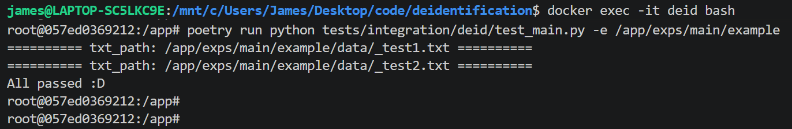

# Introduction

A service (gateway) deployed on a computer accessible to cloud API.

Do deidentification + non-identification verification before calling cloud API.

User should:

1. prepare their
    + local LLM client
    + deidentification prompt & evaluation prompt
    + small dataset

2. pass evaluation test

3. allowed to use cloud API in their project by **sending request through this deidentification service**. Not directly request clound API.


**[NOTE] This repo depends on llm_client SDK**


# Setup
+ build and launch

```bash
docker compose build
docker compose up -d
```


# Step 1 - Preparation

In `exps/main/` prepare a folder structure.

Here use example as an example

    ```txt
    example/
        |_ cfg.yaml     (local llm service inherit `deid/llm_api.py/LLMAPI`)
        |_ prompts/
        |   |_ deid.txt (output pure text)
        |   |_ eval.txt (output dict with "has_pii" key)
        |_ data/*.txt   (data to be deidentified)
    ```

# Step 2 - Evaluation

+ this API depends on llm_client, see Dockerfile in detail

    ```bash
    docker compose build
    docker compose up -d
    docker exec -it deid bash
    poetry run python tests/integration/deid/test_main.py \
        -e /app/exps/main/example
    ```




# Step 3 - Allowed to use cloud API through the gateway in this repo

The above evaluation endorse custom "local LLM + prompts + data" are truely deidentified. <br>
Make sure the evaluation is passed before use cloud API !!!

1. At `cfgs/serve.yaml/main_cfg_list`, set your key and cfg_path. 

2. Check examples in `tests/integration/test_serve.py`
    + test_cloud_api_deid -> sync + pure text output 
    + test_cloud_api_pydantic_deid -> sync + dict output
    + test_async_cloud_api_deid -> async + text output
    + test_async_cloud_api_pydantic_deid -> async + dict output


# Detail

Review each components from low to high, <br>
each can be customized by inheritance or parallel expansion.

1. local llm: deid.llm_api.VLLMChat
    + call 
    + pydantic response by hint (preprocess) and jsonify (postprocess)

2. deid prompts, cache, long context: deid.deid_collections.ExampleDeid
    + setting vLLM
    + deid prompt -> eval prompt
    + LRU cache
    + Long context: splitter and divide-and-conquer 

3. deid.main.DeidPipeline
    + deidentification
    + non-identification verification

4. serve.py
    + sync cloud api (normal / pydantic)
    + async cloud api (normal / pydantic)
